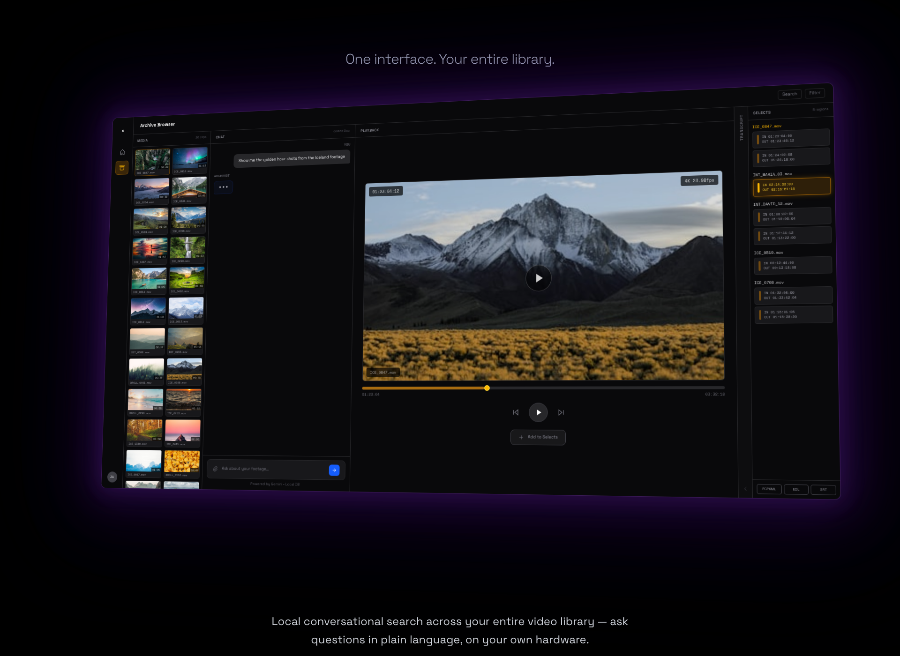

# xappio.AI

**Local conversational search across your entire video library.**



Ask questions in plain language, on your own hardware. xappio indexes footage, transcripts, and metadata — then lets you search, ideate, and build paper edits through natural conversation.

## Features

- **Archive Search** — Find clips across drives by content, dialogue, mood, or visual description
- **Live Transcript Navigation** — Scrub through footage via synchronized, searchable transcripts
- **Creative Ideation** — Attach briefs, research docs, and storyboards — build storylines in conversation
- **Media Browser** — Browse, preview, and inspect clips with full tech specs and production notes
- **Add to Selects** — Build and export selects with FCPXML, EDL, and SRT support
- **Document Attachments** — Cross-reference PDFs, Google Docs, and images against your archive

## Tech Stack

- Next.js 16 (App Router, TypeScript)
- Tailwind CSS v4
- Fonts: Space Grotesk + Space Mono
- Images: Unsplash CDN (no local assets)

## Getting Started

```bash
npm install
npm run dev
```

Open [http://localhost:3000](http://localhost:3000).

## Project Structure

```
src/
├── app/
│   ├── globals.css             # Tailwind + animations (selectsPulse, cursor blink)
│   ├── layout.tsx              # Root layout: fonts, nav, black bg
│   ├── page.tsx                # Homepage — section ordering
│   ├── join-beta/page.tsx      # Beta signup placeholder
│   └── marketing/page.tsx      # Marketing placeholder
├── components/
│   ├── HeroSection.tsx         # Full-viewport hero with typing animation
│   ├── TypingAnimation.tsx     # 15-query typing state machine
│   ├── IsometricUI.tsx         # 3D archive search demo — "Golden Hour Discovery"
│   ├── DescriptionSection.tsx  # Value prop + CTA
│   ├── TranscriptUI.tsx        # Transcript navigation with scene-matched playback
│   ├── IdeationUI.tsx          # Creative ideation with document attachments
│   ├── MediaBrowserUI.tsx      # Media browser with detail modal
│   ├── VideoPlaceholder.tsx    # Testimonials section
│   └── Navigation.tsx          # Fixed top nav
└── lib/
    └── images.ts               # Shared image URLs + getHighRes() helper
```

## Sections

| Section | Description |
|---------|-------------|
| Hero | Animated typing queries showcasing natural language search |
| Archive Search | 3D isometric UI demo — chat, media grid, playback, selects |
| Transcript | Timeline scrubbing with live transcript and AI-guided navigation |
| Ideation | Attach documents, cross-reference research, build episode storylines |
| Media Browser | Grid browse, preview, detail modal with transcript/scene/notes tabs |

## License

Proprietary. All rights reserved.
